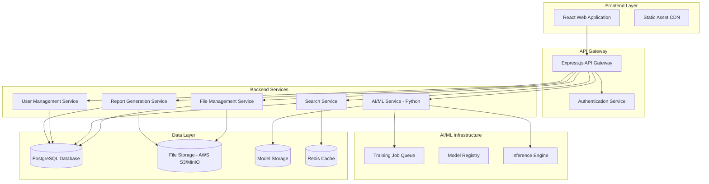

# Design Document

## Overview

The CAD AI Platform is designed as a modern full-stack web application with a microservices architecture to handle the complex requirements of CAD image management, AI model training, and intelligent search capabilities. The system will be built using React for the frontend, Node.js/Express for the backend API, Python services for AI/ML operations, and PostgreSQL for data persistence.

The architecture emphasizes scalability, security, and maintainability while providing a responsive user experience for managing large CAD datasets and AI model interactions.

## Architecture

### High-Level Architecture



### Technology Stack

**Frontend:**
- React 18 with TypeScript
- Material-UI or Ant Design for component library
- React Query for state management and API caching
- React Router for navigation
- Three.js or Babylon.js for CAD file visualization
- Axios for HTTP requests

**Backend API:**
- Node.js with Express.js framework
- TypeScript for type safety
- JWT for authentication
- Multer for file upload handling
- Socket.io for real-time updates (training progress)

**AI/ML Services:**
- Python with FastAPI framework
- TensorFlow/PyTorch for neural network models
- OpenAI API or Hugging Face for LLM integration
- Celery for background task processing
- Redis for task queue management

**Database & Storage:**
- PostgreSQL for relational data
- Redis for caching and session storage
- AWS S3 or MinIO for file storage
- Elasticsearch for advanced search capabilities

**Infrastructure:**
- Docker containers for all services
- Docker Compose for local development
- Nginx as reverse proxy
- PM2 for Node.js process management

## Components and Interfaces

### Frontend Components

#### 1. Authentication Components
- **LoginForm**: User authentication interface with role-based redirection
- **RoleBasedRoute**: Route protection based on user roles (admin, engineer, viewer)
- **UserProfile**: User profile management with password change and preferences

#### 2. File Management Components
- **FileUploader**: Drag-and-drop file upload with progress tracking and error handling
- **FileGrid**: Grid view of CAD files with thumbnails, metadata, and filtering options
- **FileViewer**: CAD file preview using WebGL viewer with navigation controls
- **VersionHistory**: Version control interface showing file evolution and change descriptions

#### 3. Search Components
- **SearchBar**: Natural language and keyword search input with auto-suggestions
- **FilterPanel**: Advanced filtering options (date, tags, type, project, etc.)
- **SearchResults**: Display search results with previews, relevance scores, and metadata
- **ModelSelector**: Choose AI model for search queries with performance indicators

#### 4. AI/ML Components
- **DatasetCreator**: Interface for creating custom datasets with file selection and labeling
- **TrainingDashboard**: Real-time training progress, metrics visualization, and job management
- **ModelManager**: Manage trained models, view performance metrics, and model comparison
- **FeedbackInterface**: User feedback collection for search results to improve model performance

#### 5. Admin Components
- **UserManagement**: Admin interface for user roles, permissions, and account management
- **SystemMonitoring**: System health, performance metrics, and resource utilization
- **ModelTrainingQueue**: Manage training jobs, priorities, and resource allocation

### Backend API Interfaces

#### 1. Authentication API
```typescript
interface AuthAPI {
  POST /api/auth/login: { email: string, password: string } → { token: string, user: User }
  POST /api/auth/register: { userData: UserRegistration } → { user: User }
  POST /api/auth/refresh: { refreshToken: string } → { token: string }
  POST /api/auth/logout: {} → { success: boolean }
  POST /api/auth/forgot-password: { email: string } → { success: boolean }
  POST /api/auth/reset-password: { token: string, password: string } → { success: boolean }
}
```

#### 2. File Management API
```typescript
interface FileAPI {
  POST /api/files/upload: FormData → { files: CADFile[] }
  GET /api/files: { filters?: FileFilters, pagination?: Pagination } → { files: CADFile[], pagination: Pagination }
  GET /api/files/:id: {} → { file: CADFile }
  GET /api/files/:id/versions: {} → { versions: CADFileVersion[] }
  PUT /api/files/:id: { metadata: Partial<CADFile> } → { file: CADFile }
  DELETE /api/files/:id: {} → { success: boolean }
  GET /api/files/:id/download: {} → FileStream
  GET /api/files/:id/thumbnail: {} → ImageStream
}
```

#### 3. Search API
```typescript
interface SearchAPI {
  POST /api/search/query: { query: string, filters?: SearchFilters, modelId?: string } → { results: SearchResult[] }
  POST /api/search/feedback: { queryId: string, resultId: string, rating: number, comment?: string } → { success: boolean }
  GET /api/search/suggestions: { partial: string } → { suggestions: string[] }
  GET /api/search/history: { userId: string } → { queries: SearchQuery[] }
}
```

#### 4. AI/ML API
```typescript
interface AIAPI {
  POST /api/ai/datasets: { name: string, description?: string, files: string[] } → { dataset: Dataset }
  GET /api/ai/datasets: {} → { datasets: Dataset[] }
  POST /api/ai/train: { datasetId: string, modelConfig: ModelConfig } → { trainingJob: TrainingJob }
  GET /api/ai/training/:jobId: {} → { job: TrainingJob, metrics: TrainingMetrics }
  GET /api/ai/models: {} → { models: AIModel[] }
  POST /api/ai/inference: { modelId: string, query: string } → { results: InferenceResult[] }
  DELETE /api/ai/models/:id: {} → { success: boolean }
}
```

#### 5. User Management API
```typescript
interface UserAPI {
  GET /api/users: { filters?: UserFilters } → { users: User[] }
  POST /api/users: { userData: UserCreation } → { user: User }
  PUT /api/users/:id: { userData: Partial<User> } → { user: User }
  DELETE /api/users/:id: {} → { success: boolean }
  GET /api/users/:id/activity: {} → { activities: UserActivity[] }
}
```

#### 6. Reports API
```typescript
interface ReportsAPI {
  GET /api/reports/usage: { dateRange: DateRange } → { report: UsageReport }
  GET /api/reports/performance: { modelId?: string } → { report: PerformanceReport }
  GET /api/reports/audit: { filters?: AuditFilters } → { report: AuditReport }
  POST /api/reports/export: { reportType: string, format: 'csv' | 'pdf' } → { downloadUrl: string }
}
```

## Data Models

### Core Entities

#### 1. User Model
```typescript
interface User {
  id: string
  email: string
  username: string
  role: 'admin' | 'engineer' | 'viewer'
  createdAt: Date
  updatedAt: Date
  lastLoginAt: Date
  isActive: boolean
  preferences: UserPreferences
}

interface UserPreferences {
  theme: 'light' | 'dark'
  defaultSearchModel?: string
  notificationSettings: NotificationSettings
}
```

#### 2. CAD File Model
```typescript
interface CADFile {
  id: string
  filename: string
  originalName: string
  fileSize: number
  mimeType: string
  uploadedBy: string
  uploadedAt: Date
  tags: string[]
  projectName?: string
  partName?: string
  description?: string
  metadata: CADMetadata
  versions: CADFileVersion[]
  thumbnailUrl?: string
  fileUrl: string
  currentVersion: number
}

interface CADFileVersion {
  id: string
  fileId: string
  versionNumber: number
  filename: string
  fileSize: number
  uploadedBy: string
  uploadedAt: Date
  changeDescription?: string
  fileUrl: string
}

interface CADMetadata {
  dimensions?: { width: number, height: number, depth?: number }
  units?: string
  software?: string
  drawingScale?: string
  layerCount?: number
  extractedText?: string[]
  boundingBox?: BoundingBox
  materialProperties?: MaterialProperties
}
```

#### 3. Dataset Model
```typescript
interface Dataset {
  id: string
  name: string
  description?: string
  createdBy: string
  createdAt: Date
  updatedAt: Date
  fileCount: number
  files: string[] // CADFile IDs
  status: 'creating' | 'ready' | 'training' | 'error'
  tags: string[]
  labels: DatasetLabel[]
}

interface DatasetLabel {
  fileId: string
  label: string
  confidence?: number
  createdBy: string
  createdAt: Date
}
```

#### 4. AI Model
```typescript
interface AIModel {
  id: string
  name: string
  description?: string
  type: 'cnn' | 'transformer' | 'hybrid'
  version: string
  trainingDatasetId: string
  createdBy: string
  createdAt: Date
  status: 'training' | 'ready' | 'failed' | 'deprecated'
  performance: ModelPerformance
  config: ModelConfig
  modelPath: string
  isDefault: boolean
}

interface ModelPerformance {
  accuracy: number
  precision: number
  recall: number
  f1Score: number
  trainingLoss: number
  validationLoss: number
  trainingTime: number
  inferenceTime: number
}

interface ModelConfig {
  architecture: string
  hyperparameters: Record<string, any>
  trainingConfig: TrainingConfig
}
```

#### 5. Search Query Model
```typescript
interface SearchQuery {
  id: string
  userId: string
  query: string
  queryType: 'natural_language' | 'filtered' | 'hybrid'
  filters?: SearchFilters
  modelId?: string
  results: SearchResult[]
  timestamp: Date
  responseTime: number
  resultCount: number
}

interface SearchResult {
  fileId: string
  relevanceScore: number
  confidence: number
  matchedFeatures: string[]
  userFeedback?: UserFeedback
}

interface UserFeedback {
  rating: number // 1-5 stars
  comment?: string
  timestamp: Date
  helpful: boolean
}

interface SearchFilters {
  dateRange?: DateRange
  tags?: string[]
  projectName?: string
  partName?: string
  fileSize?: { min?: number, max?: number }
  uploadedBy?: string[]
}
```

### Database Schema Design

#### PostgreSQL Tables

**users**
- id (UUID, PRIMARY KEY)
- email (VARCHAR, UNIQUE)
- username (VARCHAR, UNIQUE)
- password_hash (VARCHAR)
- role (ENUM: admin, engineer, viewer)
- created_at (TIMESTAMP)
- updated_at (TIMESTAMP)
- last_login_at (TIMESTAMP)
- is_active (BOOLEAN)
- preferences (JSONB)

**cad_files**
- id (UUID, PRIMARY KEY)
- filename (VARCHAR)
- original_name (VARCHAR)
- file_size (BIGINT)
- mime_type (VARCHAR)
- uploaded_by (UUID, FOREIGN KEY → users.id)
- uploaded_at (TIMESTAMP)
- tags (TEXT[])
- project_name (VARCHAR)
- part_name (VARCHAR)
- description (TEXT)
- metadata (JSONB)
- thumbnail_url (VARCHAR)
- file_url (VARCHAR)
- current_version (INTEGER)
- created_at (TIMESTAMP)
- updated_at (TIMESTAMP)

**cad_file_versions**
- id (UUID, PRIMARY KEY)
- file_id (UUID, FOREIGN KEY → cad_files.id)
- version_number (INTEGER)
- filename (VARCHAR)
- file_size (BIGINT)
- uploaded_by (UUID, FOREIGN KEY → users.id)
- uploaded_at (TIMESTAMP)
- change_description (TEXT)
- file_url (VARCHAR)

**datasets**
- id (UUID, PRIMARY KEY)
- name (VARCHAR)
- description (TEXT)
- created_by (UUID, FOREIGN KEY → users.id)
- created_at (TIMESTAMP)
- updated_at (TIMESTAMP)
- file_count (INTEGER)
- status (ENUM: creating, ready, training, error)
- tags (TEXT[])

**dataset_files** (junction table)
- dataset_id (UUID, FOREIGN KEY → datasets.id)
- file_id (UUID, FOREIGN KEY → cad_files.id)
- label (VARCHAR)
- confidence (DECIMAL)
- created_by (UUID, FOREIGN KEY → users.id)
- created_at (TIMESTAMP)
- PRIMARY KEY (dataset_id, file_id)

**ai_models**
- id (UUID, PRIMARY KEY)
- name (VARCHAR)
- description (TEXT)
- type (ENUM: cnn, transformer, hybrid)
- version (VARCHAR)
- training_dataset_id (UUID, FOREIGN KEY → datasets.id)
- created_by (UUID, FOREIGN KEY → users.id)
- created_at (TIMESTAMP)
- status (ENUM: training, ready, failed, deprecated)
- performance (JSONB)
- config (JSONB)
- model_path (VARCHAR)
- is_default (BOOLEAN)

**search_queries**
- id (UUID, PRIMARY KEY)
- user_id (UUID, FOREIGN KEY → users.id)
- query (TEXT)
- query_type (ENUM: natural_language, filtered, hybrid)
- filters (JSONB)
- model_id (UUID, FOREIGN KEY → ai_models.id)
- timestamp (TIMESTAMP)
- response_time (INTEGER)
- result_count (INTEGER)

**search_results**
- id (UUID, PRIMARY KEY)
- query_id (UUID, FOREIGN KEY → search_queries.id)
- file_id (UUID, FOREIGN KEY → cad_files.id)
- relevance_score (DECIMAL)
- confidence (DECIMAL)
- matched_features (TEXT[])
- position (INTEGER)

**user_feedback**
- id (UUID, PRIMARY KEY)
- query_id (UUID, FOREIGN KEY → search_queries.id)
- result_id (UUID, FOREIGN KEY → search_results.id)
- user_id (UUID, FOREIGN KEY → users.id)
- rating (INTEGER)
- comment (TEXT)
- helpful (BOOLEAN)
- timestamp (TIMESTAMP)

**audit_logs**
- id (UUID, PRIMARY KEY)
- user_id (UUID, FOREIGN KEY → users.id)
- action (VARCHAR)
- resource_type (VARCHAR)
- resource_id (UUID)
- details (JSONB)
- ip_address (INET)
- user_agent (TEXT)
- timestamp (TIMESTAMP)

## Error Handling

### Frontend Error Handling
- **Global Error Boundary**: Catch and display React component errors gracefully
- **API Error Interceptor**: Handle HTTP errors and display user-friendly messages
- **Form Validation**: Client-side validation with clear error messages and field highlighting
- **Network Error Handling**: Offline detection and retry mechanisms with user feedback
- **File Upload Errors**: Progress tracking and error recovery for large uploads with resume capability

### Backend Error Handling
- **Centralized Error Middleware**: Consistent error response format across all endpoints
- **Input Validation**: Request validation using Joi or Yup with detailed validation messages
- **Database Error Handling**: Connection pooling, transaction rollback, and retry logic
- **File Processing Errors**: Graceful handling of corrupted or unsupported files with fallback options
- **AI Service Errors**: Fallback mechanisms when AI services are unavailable or overloaded

### Error Response Format
```typescript
interface ErrorResponse {
  success: false
  error: {
    code: string
    message: string
    details?: any
    timestamp: Date
    requestId: string
    suggestions?: string[]
  }
}
```

### Common Error Scenarios
1. **File Upload Failures**: Network interruption, file size limits, unsupported formats, storage quota exceeded
2. **AI Model Training Errors**: Insufficient data, resource constraints, configuration errors, timeout issues
3. **Search Service Downtime**: Fallback to basic database search with reduced functionality
4. **Authentication Failures**: Token expiration, invalid credentials, session timeout, account lockout
5. **Database Connection Issues**: Connection pooling exhaustion, query timeout, transaction deadlocks

## Testing Strategy

### Frontend Testing
- **Unit Tests**: Jest and React Testing Library for component testing with >90% coverage
- **Integration Tests**: Testing component interactions and API integration scenarios
- **E2E Tests**: Cypress for critical user workflows including file upload and search
- **Visual Regression Tests**: Chromatic for UI consistency across different browsers
- **Accessibility Tests**: axe-core for WCAG 2.1 AA compliance validation
- **Performance Tests**: Lighthouse CI for performance regression detection

### Backend Testing
- **Unit Tests**: Jest for individual function and service testing with mocking
- **Integration Tests**: Supertest for API endpoint testing with test database
- **Database Tests**: Test database operations with proper setup/teardown
- **Load Tests**: Artillery or k6 for performance and scalability testing
- **Security Tests**: OWASP ZAP for vulnerability scanning and penetration testing
- **Contract Tests**: Pact for API contract testing between services

### AI/ML Testing
- **Model Performance Tests**: Validate accuracy, precision, recall metrics against benchmarks
- **Data Pipeline Tests**: Test data preprocessing and feature extraction pipelines
- **Inference Tests**: Validate model predictions and response times under load
- **A/B Testing**: Compare different model versions in production with statistical significance
- **Bias Testing**: Ensure models perform fairly across different data types and categories
- **Regression Tests**: Ensure model updates don't degrade performance on existing datasets

This design provides a comprehensive foundation for building the CAD AI Platform with scalability, security, and performance in mind. The modular architecture allows for independent development and deployment of different services while maintaining clear interfaces and data consistency.